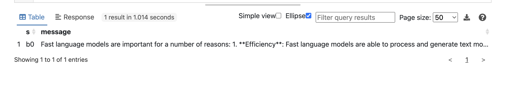
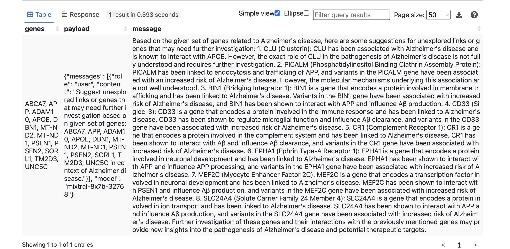
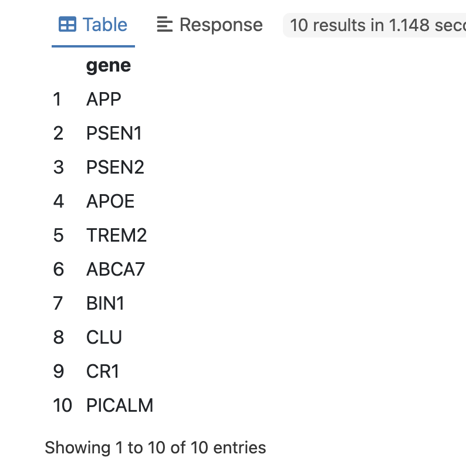
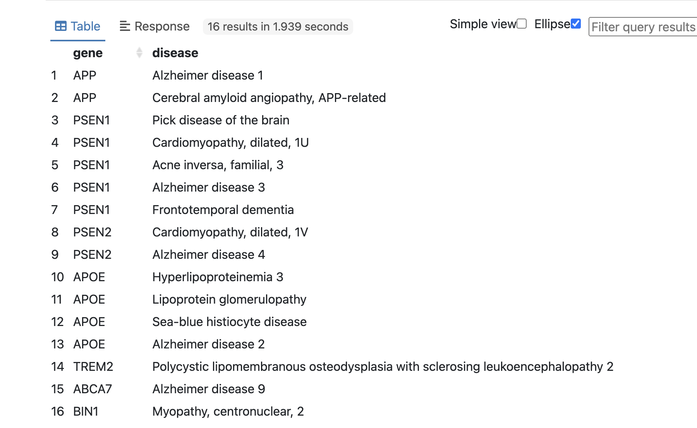

Title: Exploring SPARQL-LLM integrations
Date: 2024-12-25
Tags: SPARQL, LLM

The integration of Large Language Models (LLMs) with knowledge graphs is gaining significant traction, particularly in the context of Retrieval-Augmented Generation (RAGs). In these scenarios, LLMs usually act as interfaces for querying and summarizing information retrieved from a knowledge graph. However, other scenarios are yet to be explored. In this blog post, we explore the innovative application of LLMs for enriching structured data directly through SPARQL queries. Using the SPARQL.anything framework and the GROQ API, we'll demonstrate how to interact with a remote LLM, unlocking new possibilities for knowledge enrichment.

### Introduction to SPARQL.anything

For those who are interested in knowledge graphs and data integration using RDF,  [SPARQL.anything](https://sparql-anything.cc/) is a powerful framework that allows users to query various data sources using the SPARQL query language. It supports querying different types of data sources, including JSON, XML, relational databases, and even remote APIs.

SPARQL.anything functions as both a CLI and a server (utilizing Apache Fuseki). For a deeper dive, you can refer to the [documentation](https://sparql-anything.readthedocs.io/stable/#using-the-server).
In this experiment, we will run the server using a simple command.

```
java -jar sparql-anything-server-<version>.jar
``` 

The Fuseki console should be accessible at [http://localhost:3000/sparql](http://localhost:3000/sparql).

### GROQ API

In our experiment, GROQ, a remote LLM API, was queried using SPARQL.anything due to its ultra-low latency and cost efficiency.

Create GROQ API keys on [https://console.groq.com/keys](https://console.groq.com/keys). For these experiments, We will use *mixtral-8x7b-32768.*

### Playing with queries

Once the environment is set up, we can fire some SPARQL query example:

```sparql
PREFIX xyz: <http://sparql.xyz/facade-x/data>  
PREFIX rdfs: <http://www.w3.org/2000/01/rdf-schema#>  
PREFIX fx: <http://sparql.xyz/facade-x/ns>

SELECT * WHERE {  
  SERVICE <x-sparql-anything:https://api.groq.com/openai/v1/chat/completions>  
  {  
    fx:properties fx:media-type "application/json" ;  
    fx:http.header.Authorization "Bearer gsk_*****" ;  
    fx:http.header.Content-Type "application/json" ;  
    fx:use-rdfs-member true ;  
    fx:http.method "POST" ;  
    fx:http.payload '{"messages": [{"role": "user", "content": "Explain the importance of fast language models"}], "model": "mixtral-8x7b-32768"}' .  
    ?s xyz:choices/rdfs:member/xyz:message/xyz:content ?message .  
  }  
}
```

The query successfully returned the requested data from the LLM GROQ API which is shown in Fuseki console.



Not bad.
Notice special properties such as `fx:http.payload` or `fx:http.header.Authorization` that are used to interact with the GROQ API.

Let's explore more practical use cases by applying some domain knowledge base, such as the publicly available SPARQL endpoint for Uniprot [https://sparql.uniprot.org/sparql](https://sparql.uniprot.org/sparql).

We can try to retrieve all genes associated with Alzheimer's disease from Uniprot and generate some preliminary hypotheses from LLM suitable for further exploration.
The prompt for this task could be structured as follows:  
*Suggest unexplored links or genes that may need further investigation based on existing set of genes … in context of Alzheimer disease.*

SPARQL Query might look like:

```sparql
PREFIX xyz: <http://sparql.xyz/facade-x/data/>
PREFIX rdfs: <http://www.w3.org/2000/01/rdf-schema#>
PREFIX fx: <http://sparql.xyz/facade-x/ns/>
PREFIX up: <http://purl.uniprot.org/core/>
PREFIX taxon: <http://purl.uniprot.org/taxonomy/>
PREFIX skos: <http://www.w3.org/2004/02/skos/core#>

SELECT ?genes ?payload ?message 
WHERE 
{
  SERVICE <x-sparql-anything:https://api.groq.com/openai/v1/chat/completions> {
    SERVICE <https://sparql.uniprot.org/sparql> 
    {
      SELECT (GROUP_CONCAT(?name; separator=", ") AS ?genes)
        {
          ?protein a up:Protein . 
          ?protein up:organism taxon:9606 .
          ?protein up:encodedBy ?gene . 
          ?gene skos:prefLabel ?name .
          ?protein up:annotation ?annotation .
          ?annotation a up:Disease_Annotation .
          ?annotation up:disease/skos:prefLabel ?disease .
          FILTER (CONTAINS(?disease, "Alzheimer disease"))
        }
      }
    BIND(CONCAT('{"messages": [{"role": "user", "content": "Suggest unexplored links or genes that may need further investigation based on existing set of genes: ', 
        coalesce(?genes), 
      ' in context of Alzheimer disease."}], "model": "mixtral-8x7b-32768"}') AS ?payload)
    fx:properties fx:media-type "application/json" ;
                  fx:http.header.Authorization "Bearer gsk_*****" ;
                  fx:http.header.Content-Type "application/json" ;
                  fx:use-rdfs-member true ;
                  fx:http.method "POST" ;
                  fx:http.payload ?payload.
    [] xyz:choices/rdfs:member/xyz:message/xyz:content ?message .
  }
}

```

Result:



This is useful already.

Let's investigate if we can get a more structured output from the LLM. We can apply json mode (supported from Groq API) and rephrase our prompt by introducing a system prompt for that purpose:

```sparql
PREFIX xyz: <http://sparql.xyz/facade-x/data/>
PREFIX rdfs: <http://www.w3.org/2000/01/rdf-schema#>
PREFIX fx: <http://sparql.xyz/facade-x/ns/>
SELECT ?gene 
{
  SERVICE <x-sparql-anything:https://api.groq.com/openai/v1/chat/completions> 
  {
    BIND(CONCAT('{"messages": [',
        '{"role": "system", "content": "You are clinical expert in domain of Alzheimer disease"},',
        '{"role": "user", "content": "return most important genes linked to Alzheimer disease. Return the genes json array where every member has one field gene_name"}],',
         '"model": "mixtral-8x7b-32768",',
         '"temperature": 0.19,',
         '"response_format": {"type": "json_object"}}') AS ?payload)
    fx:properties fx:media-type "application/json" ;
                  fx:http.header.Authorization "Bearer gsk_*****" ;
                  fx:http.header.Content-Type "application/json" ;
                  fx:use-rdfs-member true ;
                  fx:http.method "POST" ;
                  fx:http.payload ?payload.
    [] xyz:choices/rdfs:member/xyz:message/xyz:content ?content .
    
    SERVICE <x-sparql-anything:> 
    {
      fx:properties fx:content ?content ;
                    fx:media-type  "application/json" .
      [] fx:anySlot/xyz:gene_name ?gene .
    }
  }
}
```
returns:



We can double-check the LLM response above by looking up the gene-disease annotation in Uniprot:

```sparql
PREFIX xyz: <http://sparql.xyz/facade-x/data/>
PREFIX rdfs: <http://www.w3.org/2000/01/rdf-schema#>
PREFIX fx: <http://sparql.xyz/facade-x/ns/>
PREFIX up: <http://purl.uniprot.org/core/>
PREFIX taxon: <http://purl.uniprot.org/taxonomy/>
PREFIX skos: <http://www.w3.org/2004/02/skos/core#>

SELECT ?gene ?disease
{
  SERVICE <x-sparql-anything:https://api.groq.com/openai/v1/chat/completions> 
  {
    BIND(CONCAT('{"messages": [',
        '{"role": "system", "content": "You are clinical expert in domain of Alzheimer disease"},',
        '{"role": "user", "content": "return most important genes linked to Alzheimer disease. Return the genes json array where every member has one field gene_name"}],',
         '"model": "mixtral-8x7b-32768",',
         '"temperature": 0.19,',
         '"response_format": {"type": "json_object"}}') AS ?payload)
    fx:properties fx:media-type "application/json" ;
                  fx:http.header.Authorization "Bearer gsk_******" ;
                  fx:http.header.Content-Type "application/json" ;
                  fx:use-rdfs-member true ;
                  fx:http.method "POST" ;
                  fx:http.payload ?payload.
    [] xyz:choices/rdfs:member/xyz:message/xyz:content ?content .
    
    SERVICE <x-sparql-anything:> 
    {
      fx:properties fx:content ?content ;
                    fx:media-type  "application/json" .
      [] fx:anySlot/xyz:gene_name ?gene .
    }
    
    SERVICE <https://sparql.uniprot.org/sparql> 
    {
      ?protein a up:Protein . 
      ?protein up:organism taxon:9606 .
      ?protein up:encodedBy/skos:prefLabel ?gene .
      ?protein up:annotation ?annotation .
      ?annotation a up:Disease_Annotation .
      ?annotation up:disease/skos:prefLabel ?disease .
   }  
 }
}
```



Subsequently, the LLM GROQ API was utilized to rapidly return gene names associated with Alzheimer disease as described in prompt. Since the result from API is returned as a stringified JSON object, additional processing is done using `fx:anySlot` magic property. The retrieved gene names were then combined with the gene-disease annotation data obtained from the Uniprot database for further verification. This integration of data from multiple sources facilitated a comprehensive analysis of the relationship between the identified genes and their associated diseases.

### Conclusion

What we've shown so far:

- We used SPARQL.anything to query a remote LLM GROQ API using JSON mode.
- We can send the results from a standard Knowledge Graph (i.e. local or remote triple store) to an LLM (local or remote) for some extra work like summarizing the data.
- The results from a LLM can be combined back with the results from a Knowledge Graph. This could be useful for things like verification, data enrichment or even reasoning.


### Additional Notes

Here are some additional notes from my experiment:

- The SPARQL.anything framework is highly versatile and can be used to query a wide range of data sources.
- The GROQ API provided a convenient and flexible way to interact with the LLM.
- Make sure to correctly set Bearer token as shown in queries from above (as literal of `fx:http.header.Authorization` magic property).
- The nesting order of the SERVICE clause should be carefully considered. (see discussion here).
- The combination of SPARQL.anything and the GROQ API offers a powerful approach for querying and exploring LLMs.
- Further experimentation is needed to explore the full potential of this approach and investigate its limitations.


